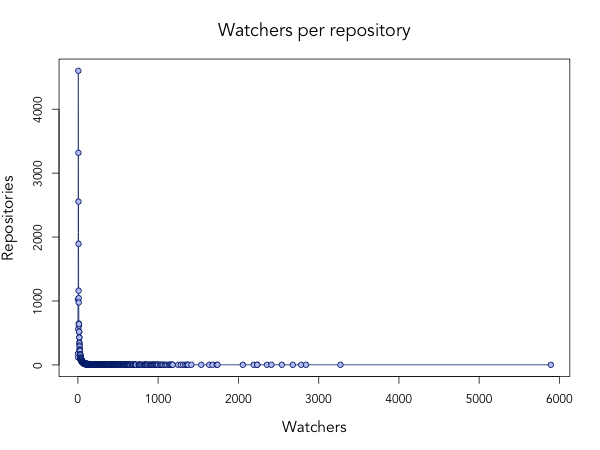
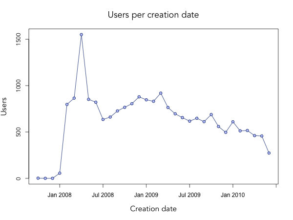

# Scouting for repositories

When I *follow* people in twitter, I get to see their messages in my profile, so I'm always aware of what they are doing.
Similarly, when I *watch* a repository in GitHub, I get to see its status and updates in my dashboard.

In this project, I analyse watchers data to discover the most talented scouts in the GitHub community.
A **talent scout** is someone who becomes aware of trends before they become successful and mainstream.
In the GitHub domain, this may refer to coders who start watching popular repositories before the majority of other programmers.
Maybe they just have a good intuit for code, or maybe it's exactly their _golden touch_ which drives a repository to popularity.
In both cases, knowing who they are might be helpful to predict future trends.

## Collecting repositories

The first step of this project is to collect a large set of repositories from GitHub.
For this purpose, I make use of [py-github](http://github.com/dustin/py-github), a wrapper for the [GitHub API](http://develop.github.com) written in Python.
I write some [Python code](http://github.com/claudiob/scouts/blob/master/get_watchers.py) to retrieves about 30,000 repositories by calling:

    from github import github
    gh = github.GitHub()
    total_pages = 1000
    for page in (range(1,total_pages+1)):
      gh.repos.search('*', start_page = page)

that is, retrieving the first 1,000 pages of a wildcard search for repositories.

## Collecting watchers

The second step is to collect the list of watchers for each repository.
I write more [Python code](http://github.com/claudiob/scouts/blob/master/get_watchers.py) to loop the list of 30,000 repositories for their watchers:

    for repo in repositories:
      gh.repos.watchers(repo.username, repo.name)

I find that the number of repositories with at least one watcher is 28,452.
I'm also able to plot the distribution of number of watchers per repository.
For this purpose, I use the `groupby` function:

    from itertools import groupby
    counts = [len(repo_watchers) for repo_watchers in watchers]
    counts.sort()
    [[number_of_watchers, len(list(number_of_repos))] for number_of_watchers,number_of_repos in groupby(counts)]
    
and obtain that 1,022 repos have 1 watcher, 176 repos have 2 watchers, and so on. I export these pairs from Python and write [R code](http://github.com/claudiob/scouts/blob/master/scouts.r) to graph their distribution:

    watchers_per_repo <- read.csv("watchers_per_repo.csv")
    
    png(file="watchers_per_repo.png")
    plot(watchers_per_repo, xlab="Watchers", ylab="Repositories", main="Watchers per repository")
    dev.off()
    
    png(file="watchers_per_repo_detail.png")
    plot(watchers_per_repo[1:30,], xlab="Watchers", ylab="Repositories", main="Watchers per repository (limited to 1~30)")
    dev.off()

The resulting distribution is:

For clarity, I also plot the distribution, limited to the interval 1~30 watchers:
")
    
## Looking for talented scouts

Consider the [inherited_resources](http://github.com/josevalim/inherited_resources) repository. 
People like [Jesse Newland](http://github.com/jnewland), [Glenn Rempe](http://github.com/grempe) and [Jeff Berg](http://github.com/ministrycentered) were the first to watch this project.
On the other hand, [I started watching](http://github.com/claudiob/following) inherited_resources only when it was already popular, and 885 coders were watching it.
After me, only 43 more coders started watching this project.

My first attempt to identify talented scouts is to consider the *average position* of a coder in the list of watchers for each repository: the _earlier_ a coder watches repositories, the _higher_ the talent.

I write some [Python code](http://github.com/claudiob/scouts/blob/master/scouts.py) to implement this idea, filtering out some noise by discarding repositories with less than 4 watchers:

    scores = {}
    for repo, watchers in repositories.items():
      if watchers and len(watchers) > 4:
        for index, watcher in enumerate(watchers):
          score = [index, len(watchers)]
          if watcher in scores:
            scores[watcher][repo] = score
          else:
            scores[watcher] = {repo : score} 
    
    scouts = []
    for watcher, score in scores.items():
      degree = sum([float(pos)/length for pos, length in score.values()])/float(len(score))
      scouts.append([degree, watcher])
    
    scouts.sort()
    print [s[1] for s in scouts[:10]]  
    
## Improving the results

The previous code returns ten coders as talented scouts: [Brett Cannon](http://github.com/brettcannon), [Sias Mey](http://github.com/SiasMey), 
[This Old Coder](http://github.com/ThisOldCoder), [Alexis Jacomy](http://github.com/jacomyal), [Robert Katić](http://github.com/rkatic), 
[kwappa](http://github.com/kwappa), [shavenkat](http://github.com/shavenkat), 
[grapagnani](http://github.com/grapagnani), [John Wells](http://github.com/jbwiv) and [bentaber](http://github.com/bentaber).

Looking at these coders' GitHub pages, I realise that the technique can be improved with some noise filter: I should remove coders who watch a _reduced number of repositories_ and also coders who watch repositories from a _reduced number of users_, as these cases do not represent talented scouts.

I write more [Python code](http://github.com/claudiob/scouts/blob/master/scouts.py) to introduce these filters:

    scouts = []
    for watcher, score in scores.items():
      # Exclude self-watchers
      for repo in score.keys():
        if repo.split("/")[0] == watcher:
          del score[repo]
      # Exclude watchers of repositories of a few creators
      if len(list(set([s.split("/")[0] for s in score.keys()]))) > 4:
        degree = sum([float(pos)/length for pos, length in score.values()])/float(len(score))
        scouts.append([degree, watcher])
    
    scouts.sort()
    print [s[1] for s in scouts[:10]]  
    
## Considering the creation date

Now the results look more promising, with this list of ten coders: 
[Enderson Maia](http://github.com/enderson), [Tore Darell](http://github.com/toretore), [James MacAulay](http://github.com/jamesmacaulay), [ezmobius](http://github.com/ezmobius), [Nate Kohari](http://github.com/nkohari), [cvk](http://github.com/cvk), [Matt Renquist](http://github.com/mattrenquist), [Shanti Braford](http://github.com/sbraford), [Sevenwire](http://github.com/sevenwire) and [rabble](http://github.com/rabble).
 
These results are better, for instance Enderson Maia occupies these positions in the list of watchers:

* 'michaeldv/fat_free_crm': 7th of 1031 watchers

* 'edavis10/redmine': 3rd of 942

* 'bradbeattie/redmine-schedules-plugin': 1st of 34

* 'mszczytowski/redmine_charts': 1st of 99

* 'drnic/ruby-on-rails-tmbundle': 28th of 843

* 'timcharper/git-tmbundle': 16th of 388

* 'drnic/composite_primary_keys': 5th of 107

However, Enderson Maia and the other coders have a strong bias: 
they were among the first ones to ever join GitHub.
This gives them a clear advantage compared to more recent users.
Plus, knowing that *two years ago* they started watching some repository does not help much in predicting trends for the future.

In the next step, I will limit the search for talented scouts to coders who joined GitHub in 2010.
This will possibly provide a better glimpse to the *actual* trends that may turn into success soon.

## Collecting users

In order to know the date when a user joined GitHub, I need to retrieve the information related to each coder.
The following [Python code](http://github.com/claudiob/scouts/blob/master/get_users.py) does exactly this:

    for watcher in scores.keys():
      gh.users.show(watcher)
  
Now I can group users by creation date and discard those who joined before 2010.
For clarity, I plot the distribution of the 20,576 users in the analysis by creation date using the following [R code](http://github.com/claudiob/scouts/blob/master/scouts.r):

    users_per_date <- read.csv("users_per_date.csv")
    
    png(file="users_per_date.png", bg="white",width=600,height=450)
    plot(users_per_date[,2], xlab="Creation date", ylab="Users", main="Users per creation date", bg=rgb(0.75,0.75,1), col=rgb(0,0,0.5), cex.main=1.5, cex.lab=1.3, pch=21, type="o",family="AvenirLTStd-Book",xaxt="n")
    axis(1,  4, users_per_date[,1][4])
    axis(1, 10, users_per_date[,1][10])
    axis(1, 16, users_per_date[,1][16])
    axis(1, 22, users_per_date[,1][22])
    axis(1, 28, users_per_date[,1][28])
    axis(1, 34, users_per_date[,1][34])
    dev.off()

The distribution is:

The following [Python code](http://github.com/claudiob/scouts/blob/master/scouts.py) restricts the scouts to those created in 2010:

    recent_scouts = []
    for scout in scouts:
      user = scout[1]
      if user in users and users[user] != [] and users[user]['created_at'][:4] == '2010':
        recent_scouts.append(scout)
     
    print [s[1] for s in recent_scouts[:10]]  

# Still room for improvement

The results obtained are:
[Lewis Lane](http://github.com/lewster32), [Josh Hundley](http://github.com/hundleyj), [Aaron Ecay](http://github.com/aecay), [Milan Cermak](http://github.com/milancermak), [Pedro Antonio Souza Viegas](http://github.com/pasviegas), [André Neves](http://github.com/andrefgneves), [Tyler Stalder](http://github.com/tylerstalder), [tero](http://github.com/tero), [energio](http://github.com/energio) and [Dmitry](http://github.com/nLight).

This list looks more interesting, but there's still room for improvement.
So far, I have only considered the *relative position* of a user within the list of watchers of a repository.
However, also the *absolute number* of watchers who come *after* a user is also relevant.
In other words, "discovering" a project that will be soon watched by 10 persons or by 1,000 persons should not have the same impact.
In the next step, I will consider this weight as well.
